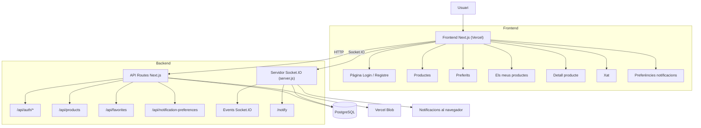
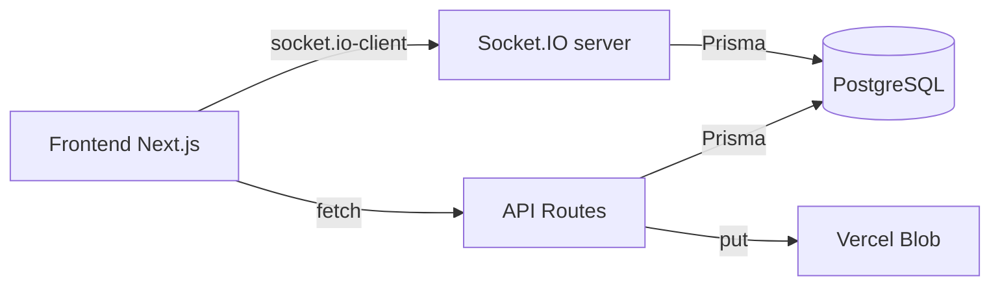
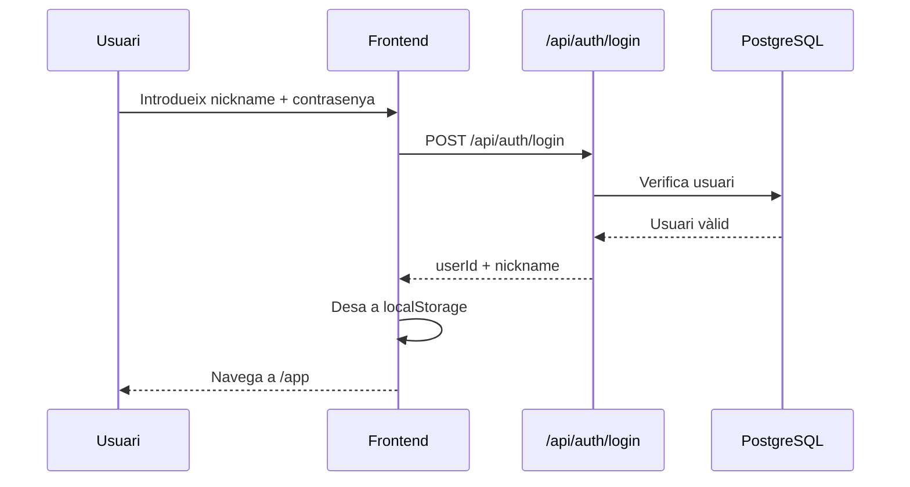
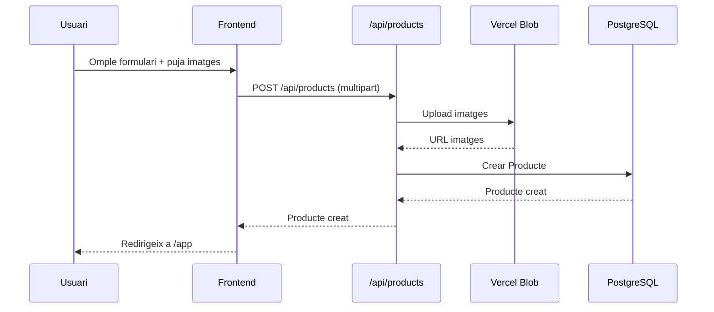
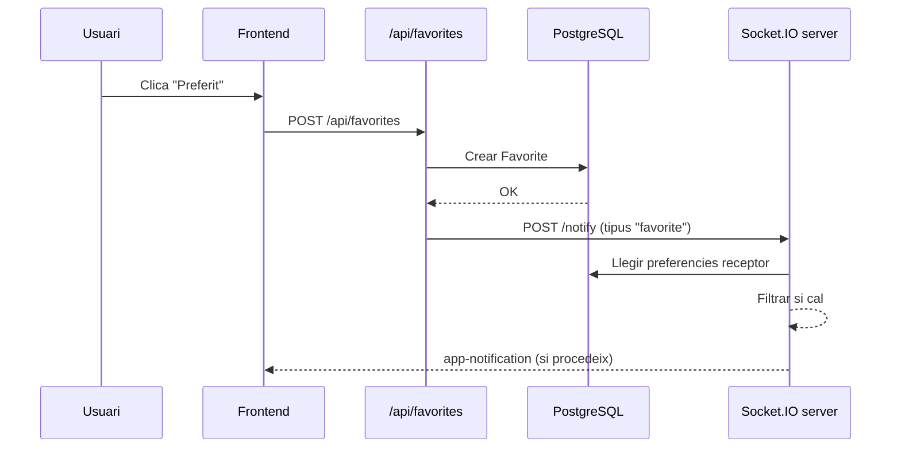
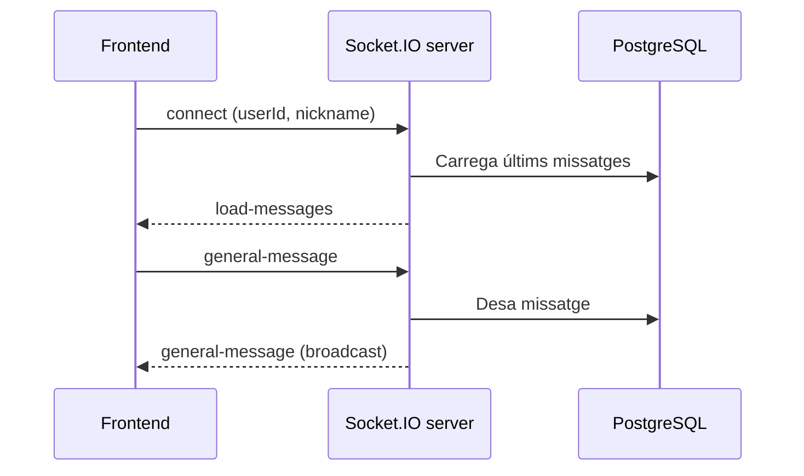
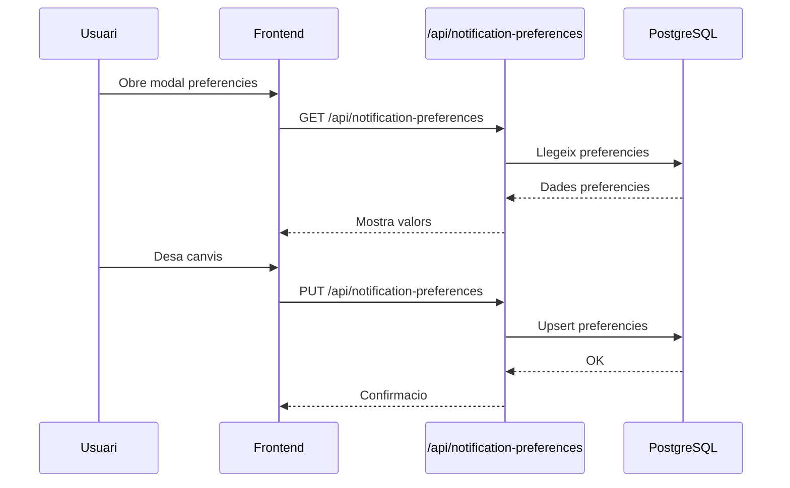

## Diagrama general

## Connexions entre components

## Flux: Autenticacio i entrada a l'app

## Flux: Publicar producte

## Flux: Afegir a preferits + notificacio

## Flux: Xat en temps real

## Flux: Preferencies de notificacions

## Notes rapides
- El frontend i les API conviuen en Next.js.
- Socket.IO corre a `server.js` i comparteix DB amb l'API.
- Les notificacions push del navegador es gestionen al client.
- Les preferencies s'apliquen abans d'emetre notificacions via `/notify`.
